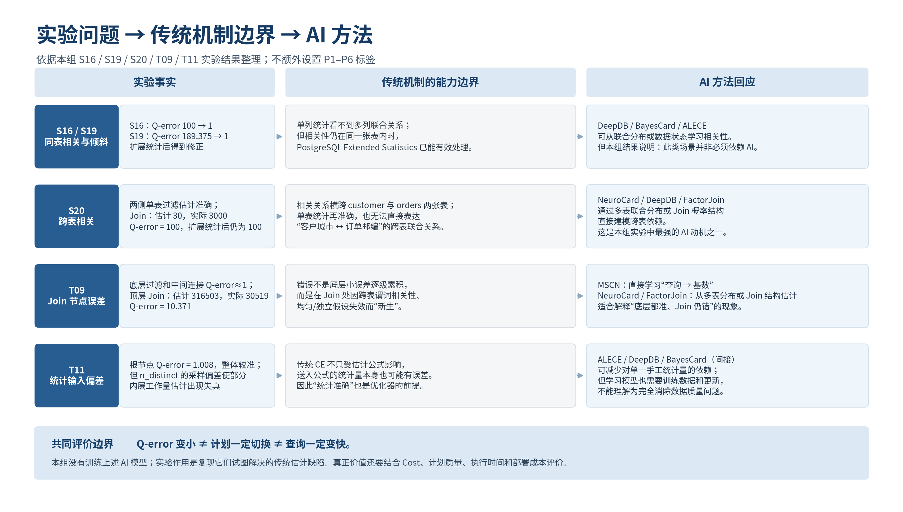
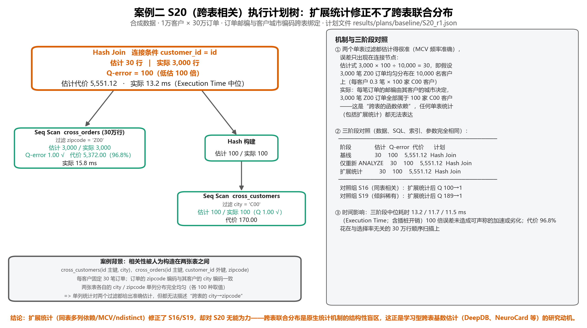
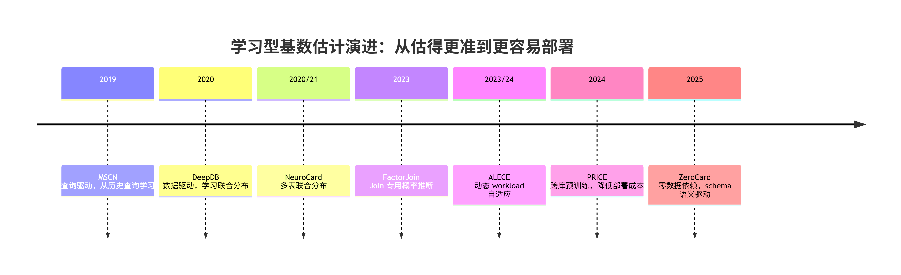
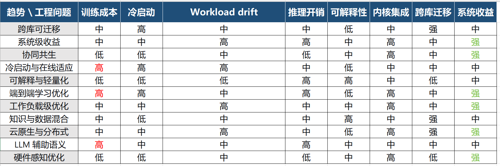
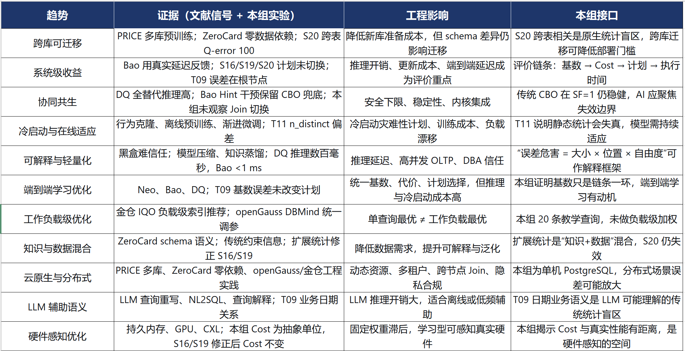
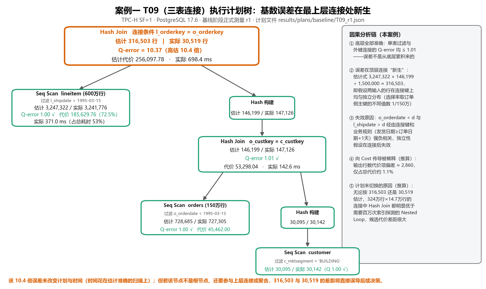

最终结论素材

摘要

本报告以本学期B/C/D已完成的PostgreSQL基数估计实验为事实基础，系统分析传统统计在什么条件下能够给出稳定估计、在什么条件下会出现明显失真，以及这些失真为什么会推动学习型基数估计方法的发展。实验覆盖20条SQL、36个查询配置组合、144份执行计划和364条节点记录。总体结果并不是"查询越复杂，估计就越差"：单表组、两表组和多表组的Q-error中位数分别约为1.003、1.010和1.066，大部分查询都比较准确。真正具有解释价值的是少数能够明确暴露相关性问题的案例：S16、S19表明同表强相关和倾斜组合可以通过PostgreSQL
Extended
Statistics得到明显修正；S20表明当相关关系跨越多张表时，单表统计的表达范围会成为限制；T09进一步说明，即使底层过滤节点都估计得很准，误差仍可能在Join处重新产生；T11则补充说明，统计信息的采样误差也会影响局部代价估计。

在此基础上，报告将MSCN、DeepDB、NeuroCard和PRICE作为四个重点模型：MSCN代表"从历史查询中学习查询到基数的关系"，DeepDB代表"从数据本身学习联合分布"，NeuroCard进一步把联合分布扩展到多表连接，PRICE则把研究重点推进到跨数据库迁移与部署成本。FactorJoin、ALECE和ZeroCard作为补充，用于说明近年学习型基数估计正在从单纯追求更低Q-error，逐步走向多表建模、动态适应和低成本部署。进一步分析把讨论从"估得更准"推进到"更容易部署、更稳定接入、更可评价"，指出学习型CE从研究原型走向数据库组件仍面临训练数据成本、冷启动、workload
drift、模型维护、推理开销、可解释性、内核集成与跨库迁移等工程问题；前沿趋势也相应地从"单库准确率"转向"跨库可迁移、系统级收益、协同共生、冷启动与在线适应、可解释与轻量化推理、端到端学习优化、工作负载级优化、知识与数据混合驱动、云原生与分布式、LLM辅助语义理解、硬件感知优化"等方向。报告还通过趋势时间线图、趋势--工程问题映射矩阵、"趋势--证据--影响--本组接口"四栏表和定性雷达图等可视化方式，对上述内容进行结构化呈现。

本组未训练、推理或评测任何AI模型，所有关于学习型方法的内容均为文献调研与问题映射，不能写成"本实验验证了AI优于PostgreSQL"。Q-error改善不自动等于计划切换或查询加速；评价应结合计划质量、端到端延迟、泛化能力、训练成本、推理开销、更新成本与内核集成难度。整组研究主线至此收束：从实验问题出发，划出传统机制边界，映射AI方法回应，再延伸到工程落地与前沿趋势，最终回到传统优化器与学习型方法协同关系的理性判断。

一、实验基础与总体判断

B/C 实验在 PostgreSQL 17.6、TPC-H SF=1 和一组可控合成数据上完成，共采集
20 条 SQL、36 个查询配置组合、144 份执行计划和 364
条节点记录。查询既包含单表过滤、两表连接、多表连接，也包含专门设计的独立属性、同表强相关、数据倾斜和跨表相关场景。每个配置先预热一次，再正式执行三次，并保存
Estimated Rows、Actual Rows、Cost、Actual Time
和节点类型等信息。这样的实验设计有两个优点：一方面可以观察真实 TPC-H
数据上的估计表现，另一方面又可以用合成数据控制"相关性到底发生在哪里"，从而把误差原因解释得更清楚。

如果只看 TPC-H 部分，PostgreSQL 的总体表现其实相当稳定。单表查询 Q-error
中位数为 1.011，两表查询为 1.020，多表查询为 1.072；12 条查询中只有 T09
出现明显的大误差，Q-error 达到 10.322，而五表连接 T11 和六表连接 T12 的
Q-error 仍然只有
1.014。这个结果非常重要，因为它说明"表越多，估计一定越差"并不成立。影响估计准确性的关键不是表数本身，而是过滤条件、连接键和数据分布之间是否存在传统统计难以表示的关系。

  ----------------------------------------------------------------------------------------------------------
  **查询/场景**   **估计行数**   **实际行数**   **Q-error**   **主要观察**
  --------------- -------------- -------------- ------------- ----------------------------------------------
  T09 三表连接    315,018        30,519         10.322        底层节点基本准确，误差集中在顶层 Join

  T11 五表连接    186,601        184,082        1.014         根节点非常准确，但局部 n_distinct
                                                              采样仍影响内层工作量估计

  S16 同表强相关  30 → 3,000     3,000          100 → 1       Extended Statistics 能修正同表联合关系

  S19             8 → 1,515      1,515          189.375 → 1   单列频率不足以表达稀有组合，扩展统计修正明显
  倾斜稀有组合                                                

  S20 跨表相关    30             3,000          100           同表扩展统计无效，跨表联合关系仍不可见
  ----------------------------------------------------------------------------------------------------------

因此，本报告将"传统统计是否失效"改写为一个更具体的问题：传统优化器已经能处理哪些关系，哪些关系仍然超出了现有统计结构的表达范围？沿着这个问题继续分析，可以把
S16/S19 与 S20/T09
分成两组。前一组说明传统数据库已经能够通过多列统计修正相当一部分同表相关问题；后一组则说明跨表相关和
Join
后联合关系仍然是明显难点。这个分界正好对应学习型基数估计从"单表联合分布"向"多表联合分布"和"查询驱动预测"发展的原因。

二、五个关键实验案例的详细分析

（一）S16：同表强相关------独立性假设为什么会把 3000 行估成 30 行

S16 使用一个 30 万行的相关表，city 和 zipcode 都各有 100
种取值，并且每个单列取值都出现 3000
次。只看单列频率时，这张表与独立对照表没有明显区别；真正的差异在于两个字段之间的组合方式。在相关表中，city=\"C00\"
与 zipcode=\"Z00\" 几乎是绑定出现的，而不是随机组合。

如果优化器把两个条件近似看成相互独立，就会分别得到 1/100
的选择率，再把两个选择率相乘：30 万 × 1/100 × 1/100 = 30。因此
PostgreSQL 基线阶段估计 30 行。实际数据中，一旦 city 已经等于
C00，zipcode 几乎就确定为 Z00，因此真实联合选择率更接近 1/100，结果是
3000 行。Q-error=100 并不是因为 PostgreSQL 不知道 C00 或 Z00
各自出现多少次，而是因为它没有在默认单列统计中保存"C00 与 Z00
是一起出现的"这一关系。

创建同表 Extended Statistics 后，S16 的估计由 30 修正为 3000，Q-error 从
100 降到
1。这个结果说明，传统优化器并非只能依靠单列直方图。只要相关关系发生在同一张表内，而且数据库能够建立多列依赖统计，许多强相关问题就可以在不引入机器学习模型的情况下得到解决。S16
因此更适合作为一个"边界起点"：它告诉我们 AI
的价值不应简单建立在"属性相关"四个字上，而要继续寻找传统多列统计仍然看不到的关系。

（二）S19：数据倾斜与相关性叠加------为什么稀有组合比热门组合更难估

S19 来自一个明显倾斜的合成表。C00/Z00
是非常热门的组合，占据了大约一半数据；其余 99
个同号组合平分剩余数据。这样的设计让优化器同时面对两个问题：一方面不同取值的频率并不均匀，另一方面
city 与 zipcode 又不是独立的。

实验中，热门组合 S18 的估计为 75,000、实际 150,000，Q-error 为
2；而稀有组合 S19 的估计只有 8、实际为 1,515，Q-error 达到
189.375。二者来自同一张表，却出现了完全不同的误差幅度。原因在于
PostgreSQL
的单列统计能够识别非常热门的取值，因此热门组合至少不会被完全当成普通值；但对于大量稀有值，单列统计往往只能知道"这个值本身很少见"，仍然不知道两个稀有值之间存在稳定的联合关系。两个小概率再被近似相乘，就会得到过小的结果。

扩展统计加入后，S18 和 S19 都被修正到 Q-error=1。S19
的分析意义在于，它把"数据倾斜"和"列相关"区分开来：真正造成极端低估的不是倾斜本身，而是倾斜背景下的联合关系没有被表示。这也解释了为什么
DeepDB、BayesCard
等方法会把学习对象从单列频率推进到联合分布或依赖结构------它们试图让模型直接学习"哪些取值经常一起出现"，而不是在查询到来时再把多个单列概率机械相乘。

（三）S20：跨表相关------单表统计全部正确，Join 仍然低估 100 倍

S20 是整个AI方法对比部分最关键的案例。实验构造了 1 万名客户和 30
万笔订单，每名客户固定有 30 笔订单。客户表只保存 city，订单表只保存
zipcode，而且订单的 zipcode 与其客户的 city 编码保持一致。查询同时要求
customer.city=\"C00\" 和 orders.zipcode=\"Z00\"，再按 customer_id
连接两张表。

单独看两侧过滤，PostgreSQL 完全估对：C00 客户估计 100 行、实际 100
行；Z00 订单估计 3000 行、实际 3000 行。但 Join 结果只估计 30
行，实际却有 3000 行。优化器相当于把 3000 笔 Z00 订单看成均匀分散在 1
万名客户上，因此认为 100 名 C00 客户只会接到其中约 1% 的订单，即 30
行。真实数据却是另一种结构：所有 Z00 订单恰好都属于 C00 客户，所以最终
3000 行全部保留下来。

这里最有价值的地方在于，两侧单表统计并没有错，真正缺失的是"客户城市"和"订单邮编"之间的跨表关系。即使在
orders 表内部建立 customer_id 与 zipcode 的扩展统计，也仍然无法直接表达
customer.city 与 orders.zipcode
的联合规律。实验中的三阶段对照非常清楚：S16 和 S19 在扩展统计后都降到
Q-error=1，而 S20 始终保持 Q-error=100，Cost 与 Hash Join
计划也保持不变。传统统计的边界因此被具体地划在了"跨表联合关系"这里。

这一现象与 NeuroCard、DeepDB、FactorJoin
等方法的研究动机高度一致。它们虽然实现方式不同，但都试图让估计器看到比单表统计更完整的联合结构：NeuroCard
直接学习多表连接空间的分布，DeepDB
用概率模型描述数据之间的联合关系，FactorJoin 则把多表 Join
转化为一组概率因子的推断。S20
因而是AI方法对比中最适合用来解释"为什么学习型多表 CE 会出现"的实验。

{width="6.141732283464567in"
height="3.0312784339457566in"}

图 1 同表扩展统计的修正效果及其跨表边界（B/C 实验图）

（四）T09：误差并不是一路累积，而是在顶层 Join 处重新产生

T09 是 TPC-H 派生查询中最有代表性的真实数据案例。该查询同时连接
customer、orders 和
lineitem，并带有客户类别、订单日期和发货日期条件。底层三个过滤节点都非常准确：lineitem
估计 3,236,751 行、实际 3,241,776 行；orders 估计 734,716 行、实际
727,305 行；customer 估计 29,805 行、实际 30,142 行。customer 与 orders
的中间 Hash Join 也几乎准确，估计 145,988 行、实际 147,126 行。

然而到了最上层 Join，估计突然变成 315,018 行，而实际只有 30,519
行，Q-error 达到 10.322。这个结果比"多表误差会层层放大"更值得分析，因为
T09 中并不存在明显的底层错误。误差是在把满足订单日期条件的 orders
与满足发货日期条件的 lineitem
连接起来时重新产生的。数据库需要判断两个筛选结果在 orderkey
上究竟有多少重合，而传统估计主要依赖连接键不同值数和近似均匀分布。

从业务含义看，订单日期和发货日期不是互不相关的两个随机属性。发货发生在下单之后，因此"较早下单"和"较晚发货"之间存在时间关系。优化器分别估计两个条件时可以很准确，但在
Join 时若仍把两边满足条件的 orderkey
看成近似均匀重合，就会高估共同出现的订单数量。D
的节点级分析甚至可以把这个估计式复现出来：3,236,751 × 145,988 ÷
1,500,000 ≈ 315,018，与 PostgreSQL 的 Plan Rows
基本一致。公式按它自己的假设算得没有问题，问题出在"两个筛选后的集合究竟怎样重合"这一信息没有被现有统计充分表达。

因此，T09 对应两类学习思路。第一类是 MSCN
这样的查询驱动方法，让模型从大量历史查询中直接学习"表、谓词、连接结构与最终基数之间的关系"；第二类是
NeuroCard、FactorJoin 这样的多表分布方法，直接把 Join
关系本身纳入建模。相比 S20 的人为强相关，T09
更接近真实业务数据，因此特别适合在汇报中说明：学习型 CE
的价值不只存在于合成数据上，真实数据库中也会出现"单表都准、Join
才错"的情况。

（五）T11：总体结果准确，并不代表每一层统计都准确

T11 是一个五表连接查询，根节点 Estimated Rows 为 186,601，Actual Rows 为
184,082，Q-error 只有
1.014。从最终输出看，它几乎可以算作"估得很准"的例子。但 D
对执行计划向下拆解后发现，lineitem.l_orderkey 的 n_distinct 统计值约为
383,583，而根据 SF=1 数据和订单规模，真实不同订单键数量约为 150
万。这个采样差异会影响 Nested Loop 内层 Index Only Scan
的每循环工作量：计划估计约 16 行，实际约 4 行。

T11
说明基数估计有两个层次：一是"最终返回多少行"，二是"为了得到这些行，中间节点要处理多少数据"。最终结果准确，并不意味着优化器对每个内部步骤的工作量都认识准确。某些误差可能在更高层被其他约束或主键统计抵消，所以根节点仍然接近真实值；但局部代价计算仍会受到影响。

从 AI 方法角度看，T11
的启示不是"机器学习可以消灭采样误差"，而是学习型估计可以尝试把更多数据状态、查询结构和历史反馈综合起来，降低对某一个单独统计量的依赖。ALECE
这类方法将数据库当前数据状态和查询一起编码，就是这一方向的代表。T11
也提醒我们，评价 learned CE
时最好观察节点级结果和最终计划，而不仅仅看根节点的一个 Q-error。

（六）从 D 的计划分析继续往下看：为什么 100 倍误差有时也不会让查询变慢

把 C 的 Q-error 结果与 D
的执行计划分析结合起来，会得到一个比"估计越准越好"更有解释力的结论：基数误差是否真正影响性能，取决于误差出现在什么位置，以及这个位置之后还有没有可选择的执行方案。S16
的 Q-error 从 100 降到 1，但合成表没有 city/zipcode
二级索引，访问方式始终只能是 Seq Scan，因此计划和 Cost 都没有变化。S20
的 100 倍误差发生在根节点，根节点之后已经没有新的 Join
或排序决策可被误导；同时该查询的绝大部分代价来自扫描 30 万行
orders，输出从 30 行变成 3 000 行并不足以改变 Hash Join 的选择。

T09 也有类似特点。10.322 倍误差发生在最上层 Hash Join，而 lineitem
扫描和下层 customer-orders Join
的估计都很准确。由于主要成本仍来自数百万行 lineitem
的顺序扫描，顶层输出规模的高估只占总代价中的较小部分，所以计划仍保持
Hash Join。换句话说，Q-error
描述的是"行数估计差了多少倍"，但查询性能还要继续经过 Cost
计算、候选计划比较和实际执行这几层。

因此，一个更适合本组实验的判断是：基数误差的影响取决于三个因素------误差有多大、误差出现得多早、后续还有多少计划选择空间。若
100 倍低估发生在一个还要继续与多张表连接的中间节点，就可能影响 Join
Order、Join Algorithm
或内存预算；若同样的误差出现在根节点，或者当前只有一种访问路径，它对性能的影响就可能很小。这个结论也决定了我们对
AI 方法的评价方式：除了
Q-error，还应关注模型是否真正帮助优化器选到了更合适的计划。

三、把实验现象翻译成 AI 方法要解决的任务

五个案例放在一起后，可以把传统基数估计的困难分成四个层次。第一层是同表多列相关，S16/S19
已经证明 PostgreSQL 的扩展统计能够处理相当一部分；第二层是跨表相关，S20
显示单表统计结构本身无法直接表达；第三层是 Join 后才出现的联合关系，T09
显示即使底层都准，连接选择率仍可能失真；第四层是数据和工作负载会持续变化，T11
所体现的统计采样问题以及实际系统中的分布漂移都会使静态统计逐渐失去代表性。不同
AI 方法之所以形成不同路线，本质上就是它们选择了不同的"学习对象"。

  -----------------------------------------------------------------------------------------------------------------------------------------------
  **实验现象**                  **传统机制的边界**                             **AI 方法希望学习什么**            **代表方法**
  ----------------------------- ---------------------------------------------- ---------------------------------- -------------------------------
  S16/S19：同表相关、倾斜组合   单列统计缺少多列联合关系；扩展统计可部分解决   直接学习多列联合分布或属性依赖     DeepDB、BayesCard

  S20：跨表相关                 单表统计看不到跨表联合关系                     学习多表数据分布或 Join 概率结构   NeuroCard、DeepDB、FactorJoin

  T09：Join 处新生误差          固定 Join 选择率公式难表达业务相关性           从查询结构或多表分布直接预测 Join  MSCN、NeuroCard、FactorJoin
                                                                               基数                               

  T11 / 动态环境                采样统计和静态模型会随数据变化失真             同时利用查询、数据状态和跨库知识   ALECE、PRICE
  -----------------------------------------------------------------------------------------------------------------------------------------------

这个映射也说明，AI CE
并不是一种统一算法。查询驱动方法关注"历史查询教会模型什么"；数据驱动方法关注"数据库本身的联合分布是什么"；多表方法进一步关注"跨表关系如何形成"；预训练方法则关注"这些能力能否在不同数据库之间复用"。因此，在AI方法对比的报告和
PPT
中，比起逐篇介绍论文，更适合按照"实验问题---学习对象---代表方法"来组织内容。

四、四个重点模型：解决问题---基本思路---适合场景---局限

（一）MSCN：从历史查询中学习"什么样的 Join 会产生多少行"

MSCN 是典型的查询驱动方法。传统优化器会先用人工公式分别计算过滤选择率和
Join 选择率，而 MSCN
直接把一条查询中涉及的表、连接条件和过滤谓词编码成模型输入，再用历史查询的真实基数作为答案进行训练。模型学习的不是某个固定公式，而是"这类查询结构、这类谓词组合通常对应多大的结果"。

它最适合与 T09 对应。T09
的底层过滤都很准，真正缺失的是订单日期、发货日期和连接键共同作用后的重合关系。MSCN
不要求先把这种业务关系写成一个明确公式，而是可以从相似历史查询中学习这种模式。对于查询模板比较稳定、历史日志比较丰富的数据库，这种方法有机会直接修正传统
Join 选择率公式难以表达的部分。

MSCN
的主要成本在数据准备。训练时需要大量查询及其真实基数，而真实基数通常需要执行查询才能获得；当线上出现训练阶段很少见的新模板，或者底层数据分布发生较大变化时，过去学到的映射也可能失效。因此它的优势主要体现在"充分利用已有
workload 经验"，而不是"对任意新数据库都天然适用"。

（二）DeepDB：从数据本身学习联合分布

DeepDB
代表另一条路线：不把大量历史查询作为主要训练对象，而是直接学习数据库中数据的联合分布。可以把它理解为让模型先回答"哪些字段、哪些取值经常一起出现"，之后再根据查询条件推断大约有多少数据满足要求。这样做的好处是，不必为每一种查询模板都事先执行大量
SQL 来获取标签。

S16 和 S19
与这一思路最直观。两个实验的问题都不是单个字段频率不准，而是多个字段组合出现的规律没有被单列统计表示。DeepDB
的价值就在于把这种"组合规律"直接作为学习对象。S20
又进一步提示，联合分布可能跨表存在，因此数据驱动路线需要进一步扩展到多表场景。

DeepDB
的限制主要来自模型维护。数据库越复杂，表和列越多，需要表达的联合关系就越多；数据持续更新后，原先学到的分布也需要及时调整。对于查询优化器来说，模型推理还必须足够快，因为估计本身发生在
SQL 真正执行之前，若估计过程过重，就可能抵消优化收益。

（三）NeuroCard：直接面向多表联合分布

NeuroCard
可以看作数据驱动路线向多表连接的一次重要推进。它使用自回归密度模型去学习多个表连接后的整体分布，希望在估计
Join
时直接利用跨表相关关系，而不是先独立估计每张表，再用简单公式把结果拼起来。

S20 是最适合解释 NeuroCard
的案例：客户城市与订单邮编的关系分散在两张表里，任何单表统计都只能看到关系的一半。NeuroCard
的目标就是让估计器在同一个模型中看到这些跨表组合，从而减少"两个单表都估对、Join
却错 100 倍"的情况。T09
同样可以用它解释，因为订单日期和发货日期的相关性最终也是通过 orderkey
在两张表之间体现出来的。

相应地，多表建模也比单表建模更重。连接空间会随着表数量增加而迅速扩大，模型需要处理
Join
键、空值、外键关系以及不同连接图；数据更新后如何快速维护模型也更复杂。因此
NeuroCard
的优势很集中：它直接瞄准跨表相关这一难点，但工程上需要在准确性、模型大小和更新成本之间做平衡。

（四）PRICE：从"每个数据库重新训练"走向跨数据库迁移

MSCN、DeepDB 和 NeuroCard 主要在回答"怎样估得更准"，PRICE
更进一步关注"怎样让一个学习型估计器更容易部署到新数据库"。早期 learned
CE
往往需要针对目标数据库重新准备训练查询、采集真实基数、训练模型。对于真实系统来说，这种准备成本会直接影响方法能否落地。

PRICE
的思路是在多个数据库上进行预训练，学习一些可以跨数据库复用的分布和查询特征。当面对一个新的数据库时，模型不再完全从零开始，而是尝试直接使用已有知识，再根据少量目标库信息进行调整。它与
S16、S20、T09 不是一一对应的关系，但它解决的是这些 learned CE
方法共同面临的下一步问题：即使模型能够处理相关性，怎样避免每换一个数据库就重新做一遍昂贵训练。

因此，PRICE 很适合作为AI方法对比的演进终点。MSCN 体现"从 workload
学"，DeepDB/NeuroCard 体现"从数据分布学"，PRICE
体现"把已经学到的能力迁移到新库"。这条路线说明 learned CE
的研究重点正在从单库准确率扩展到部署成本和迁移能力。

五、补充方法与近年演进：FactorJoin、ALECE、ZeroCard

FactorJoin（2023）仍然聚焦多表
Join，但强调更轻量的概率推断。它先学习单表的条件分布，再把多表连接表示成若干概率因子的组合，从而估计
Join 结果。与 NeuroCard
相比，它更强调避免完整物化多表连接空间，并降低训练与推理成本。对本组而言，FactorJoin
同样可以对应 S20 和 T09，用于说明"跨表
CE"并不只有大型神经网络这一条实现路线。

ALECE（2023/2024）把注意力放在动态 workload
上。它同时编码查询和数据库当前的数据状态，使估计器能够感知数据分布正在发生的变化。这个方向与
T11 的启示相通：优化器依赖的统计信息不是永远准确的，数据更新、采样和
workload 漂移都会改变估计条件。ALECE
因此代表从"静态学习模型"走向"随数据状态变化而调整"的一类方法。

ZeroCard（2025
预印本）则把部署门槛进一步压低，目标是尽量减少对目标数据库原始数据、查询日志和重新训练的依赖。它更多利用
schema
语义与预训练知识完成估计。虽然这一方向仍处在较新的研究阶段，但它与 PRICE
一起反映了一个明显趋势：学习型 CE 的竞争焦点已经不再只是"谁的 Q-error
更低"，还包括"新数据库上需要准备多少数据""是否需要重训""隐私受限时能否使用"等工程问题。

六、AI CE 方法综合比较与本组实验映射

  ----------------------------------------------------------------------------------------------------------------------------------------------------------------
  **方法**     **主要路线**      **最相关实验/问题**     **核心价值**                                           **主要局限**
  ------------ ----------------- ----------------------- ------------------------------------------------------ --------------------------------------------------
  MSCN         查询驱动          T09：Join 处新生误差    从历史查询直接学习"查询结构→基数"，减少对固定 Join     需要大量真实基数标签；新模板和分布变化会影响泛化
                                                         公式的依赖                                             

  DeepDB       数据驱动          S16/S19/S20：联合分布   直接学习数据联合分布，不必为每个查询模板准备大量标签   复杂 schema 下模型构建、更新和推理成本较高

  NeuroCard    多表数据驱动      S20、T09：跨表相关      把多表联合关系直接纳入一个模型，最贴近跨表相关问题     多表空间大，采样与模型维护复杂

  FactorJoin   Join 专用概率方法 S20、T09                用因子分解做多表 Join 推断，强调效率与可部署性         仍依赖分解假设和单表分布模型质量

  ALECE        动态 learned CE   T11/数据变化问题        将查询与当前数据状态共同建模，适合动态 workload        需要持续维护状态表示，系统集成成本存在

  PRICE        预训练/迁移       新数据库部署成本        跨数据库预训练，降低每个新库从零训练的准备成本         schema 与数据分布差异仍影响迁移效果

  ZeroCard     零样本/语义驱动   冷启动、隐私受限        进一步减少对目标库数据、日志和重训练的依赖             较新方向，零样本稳定性仍需继续验证
  ----------------------------------------------------------------------------------------------------------------------------------------------------------------

从这张表可以看出，本组实验与 AI
方法之间不是"一条查询对应一个模型"的关系，而是"一类估计困难对应一类学习对象"。S16/S19
说明联合分布很重要，但也同时证明传统扩展统计在同表场景中已经具有较强能力；S20
和 T09 才真正把问题推进到跨表分布与 Join 后相关性；T11
则提醒我们，真实优化器还要面对统计更新和数据状态变化。PRICE、ZeroCard
又把讨论从"怎样估"继续推进到"怎样部署"。这种组织方式比单纯罗列论文更能和
B/C/D 的实验形成一条完整主线。

{width="6.535433070866142in"
height="3.7092388451443568in"}

图 2 本组实验问题---传统机制边界---AI 方法映射

七、从 MSCN/DeepDB 到 PRICE：为什么 CE 开始转向可迁移

如果把这些方法按时间和研究重点放在一起，可以看到学习型基数估计的关注点正在逐步变化。早期
MSCN 的核心问题是：能否用机器学习直接替代一部分人工选择率公式，让模型从
workload 中认识复杂相关 Join。随后 DeepDB、NeuroCard
等方法进一步追问：能否不依赖大量历史查询，而是直接学习数据分布，尤其是多表联合分布。到了
PRICE，问题又向工程部署移动：即使一个模型在某个数据库上很准，如果每个新数据库都需要重新生成训练查询、执行
SQL、收集真实基数并训练模型，实际部署成本仍然很高。

因此，"可迁移"不是一个与准确率无关的额外功能，而是 learned CE
从研究原型走向数据库组件必须面对的问题。传统 PostgreSQL
统计的一个重要优势就是部署成本低：建表后 ANALYZE
即可得到基本统计，不需要历史
workload。学习型方法如果想进入相同的位置，就必须逐步降低训练数据、重训频率和数据库专用配置的要求。PRICE
的跨库预训练、ZeroCard 的零依赖尝试，实际上都在缩小这方面的差距。

结合本组实验，可以把这条演进概括为三步：第一步是"发现传统公式在哪些相关场景会错"，对应
S16、S19、T09；第二步是"让模型看到传统统计看不到的联合关系"，对应 S20 与
NeuroCard/FactorJoin；第三步是"让这些模型不再只服务于一个数据库"，对应
PRICE 与 ZeroCard。这样，E的第三页 PPT
就可以从方法介绍自然过渡到发展趋势，而不是突然增加一个与实验无关的"最新论文"部分。

八、从实验结论到工程落地：学习型 CE 还缺什么

综合前面的实验分析，传统 CBO
并非全面失效，同表相关可被扩展统计修正，真正困难集中在跨表联合分布、Join
后相关性以及统计输入本身的偏差。前面的分析已经把
MSCN、DeepDB、NeuroCard、PRICE 分别映射到
T09、S16/S19/S20、跨表相关、部署成本等不同问题，但回答"哪类 AI
方法对应哪类实验问题"只是第一步。要判断这些方法能否真正进入数据库优化器，还需要进一步讨论它们从研究原型走向数据库组件还缺什么。至少有以下八个工程问题需要在实验结论之后继续讨论。

### **（一）训练数据成本**

MSCN
这类查询驱动方法需要大量历史查询及其真实基数作为标签，而真实基数通常需要执行查询才能获得。对于复杂查询，执行成本高、耗时长；如果为了训练模型反复运行大量
SQL，采集成本本身就可能抵消优化收益。前面的分析已指出 MSCN 适合 workload
稳定的场景，但"workload 稳定"本身就是一个较强的工程前提。

### **（二）冷启动**

强化学习优化器若未经稳健初始化直接上线，随机探索可能产生灾难性执行计划，导致
CPU 独占、I/O 饱和、内存溢出。前面的分析未展开冷启动细节，但这是学习型
CE
和学习型优化器共同面临的落地瓶颈。当前主流策略是专家轨迹行为克隆、离线代价模拟器预训练、线上渐进微调，但这些策略本身也需要额外工程投入。

### **（三）Workload drift 与泛化**

分析 T11 时已经指出，统计信息会随数据变化失真。类似地，学习型模型也会随
workload
漂移而失效：训练时见过的查询模板，线上可能不再出现；线上新出现的模板，训练集中可能完全没有覆盖。数据库负载往往具有动态变化特点，静态训练出的模型需要持续更新或在线微调，否则准确率会逐渐下降。

### **（四）模型维护与更新**

DeepDB 学习联合分布，NeuroCard 学习多表 join
space，两者都面临模型维护问题。数据库越复杂，表和列越多，需要表达的联合关系就越多；数据持续更新后，原先学到的分布也需要及时调整。多表建模比单表建模更重，连接空间随表数增加迅速扩大，模型更新成本也更高。维护成本是学习型
CE 能否长期运行的关键，而不是训练一次就结束。

### **（五）推理开销**

所有学习型 CE 都必须在查询优化阶段完成估计。高并发 OLTP
场景要求优化阶段延迟极低，复杂模型推理可能成为新的瓶颈。DQ
全替代路线需要多步网络推理，单条 SQL 优化耗时可观；Bao 通过 Hint
干预将决策空间降到常数级，推理通常小于 1
毫秒。推理开销与优化质量同样重要，轻量化是工程落地的前提。（参见图1）

### **（六）可解释性**

神经网络黑盒特性限制 DBA 对异常执行计划的诊断能力。传统 CBO
可以通过统计信息和代价公式解释计划选择原因，而学习型模型通常只能给出预测值，很难清晰说明每个特征对预测结果的具体贡献。对于数据库系统，计划选择需要稳定性和可信度；缺乏解释性会影响学习型
CE
在核心优化器中的部署信任。可解释性不是附加功能，而是人机协同的必要条件。

### **（七）内核集成**

学习型 CE
需要接入优化器，与现有代价模型、计划搜索、执行引擎协同工作。是替换式使用、修正式使用还是混合式使用？工程上必须回答：模型输出如何与
Cost
结合？当模型不确定时，是否回退到传统统计？如何保证安全下限？这些问题决定了学习型
CE 是停留在研究原型，还是真正成为数据库组件。

### **（八）跨库迁移**

前面的分析已把 PRICE 定位为"从单库训练走向跨库预训练"的演进终点，并指出
schema 与数据分布差异仍影响迁移效果。跨库迁移是学习型 CE
从"为一个数据库训练一个更准的模型"走向"低成本部署到新数据库"的关键一步。PRICE
的预训练、ZeroCard
的零依赖尝试，都是在缩小这一差距，但零样本条件下的稳定性和泛化仍需更多验证。

{width="6.760416666666667in"
height="3.779166666666667in"}

图3 S20 计划树（D02）

九、可视化分析

为更清晰地呈现前文实验问题与工程落地分析，本部分补充四类可视化分析。这些图表不重复趋势文字，只作为结构化支撑。

**（一）趋势时间线图**

趋势时间线图以年份为轴，串联
MSCN（2019）、DeepDB（2020）、NeuroCard（2020/21）、FactorJoin（2023）、ALECE（2023/24）、PRICE（2024）、ZeroCard（2025）等关键节点，直观展示研究重心从"单库
Q-error"逐步转向"跨库迁移、系统级收益与工程落地"。

### {width="6.7347222222222225in" height="2.0548611111111112in"}

图4 趋势时间线图

### **（二）趋势--工程问题映射矩阵**

趋势--工程问题映射矩阵以十一条趋势为行，以训练成本、冷启动、workload
drift、推理开销、可解释性、内核集成、跨库迁移、系统收益等八类工程问题为列，用"强/中/弱"标注关联强度。矩阵显示：跨库迁移趋势与"跨库迁移"问题强相关；系统级收益趋势与"推理开销""内核集成""系统收益"强相关；冷启动与在线适应趋势与"训练成本""冷启动""workload
drift"强相关；可解释与轻量化趋势与"推理开销""可解释性"强相关。

### {width="6.766666666666667in" height="2.2472222222222222in"}

图5 趋势--工程问题矩阵

### **（三）"趋势--证据--影响--本组接口"四栏表**

四栏表将每条趋势的文献信号与本组实验证据并列，明确其工程影响与本组接口。例如：跨库可迁移趋势的证据是
PRICE 多库预训练、ZeroCard 零数据依赖与 S20 跨表 Q-error
100，工程影响是降低新库准备成本，本组接口是 S20
跨表相关；系统级收益趋势的证据是 Bao 真实延迟反馈与 S16/S19/S20
计划未切换，工程影响是推理开销与端到端延迟成为评价重点，本组接口是评价链条"基数
→ Cost → 计划 → 执行时间"。

### {width="6.754166666666666in" height="3.4694444444444446in"}

图6 "趋势--证据--影响--本组接口"四栏表

### **（四）雷达图（定性对比）**

雷达图以准确率、跨表能力、部署成本（低=好）、推理开销（低=好）、泛化能力、可解释性六个维度，对传统
CBO、MSCN、DeepDB、NeuroCard、PRICE、ZeroCard 进行定性对比。评分范围为
1--5，数值越大表示该维度表现越好。雷达图显示：传统 CBO
在部署成本、推理开销、可解释性上占优；NeuroCard
跨表能力最强但推理开销高；PRICE/ZeroCard 在泛化与部署成本上更均衡；MSCN
在准确率与推理开销上较好，但部署成本较高。该图需标注"定性示意，非本组实测"。

{width="5.013194444444444in"
height="3.0131944444444443in"}

图7 学习型CE方法能力画像雷达图

十、评价边界

本组没有训练、推理或评测任何 AI 模型。所有关于
MSCN、DeepDB、NeuroCard、PRICE、FactorJoin、ALECE、ZeroCard、Bao、DQ
的内容，均为文献调研与问题映射，不能写成"本实验验证了 AI 优于
PostgreSQL"。

因此，本组实验能够支持的评价边界是：

1.传统 CBO 仍具稳健性：在 SF=1 轻量场景下，单表组 Q-error 中位数
1.011，两表组 1.020，多表组 1.072；仅 T09 出现 10.322 的明显误差。

2.同表相关可被扩展统计修正：S16 从 100 降至 1，S19 从 189.375 降至 1。

3.跨表相关与 Join 后联合关系仍是难点：S20 两侧单表估计准确，Join 仍为 30
vs 3000，Q-error 100，扩展统计后不变；T09 底层节点 Q-error ≈ 1，顶层
Join 却为 315,018 vs 30,519。

4.统计输入本身也可能偏差：T11 根节点 Q-error 1.014，但 l_orderkey
n_distinct 估计 383,583，真实约 150 万，内层工作量存在约 4.1×
的口径偏差。

5.误差危害取决于位置与自由度：危害 ≈ 误差大小 ×
误差位置（是否被下游决策引用）× 下游决策自由度。S16、S19、S20
三阶段计划未切换；T09 误差在根节点，计划仍为 Hash Join。

6.评价链条应扩展：基数估计 → Cost → 计划选择 →
执行时间，同时关注泛化能力、训练成本、推理开销、更新成本、内核集成难度。

{width="6.760416666666667in"
height="4.022916666666666in"}

图8 T09 计划树（D01）

十一、综合结论

综合本组实验与前期分析，最重要的发现并不是"PostgreSQL
基数估计不准确"，而是不同误差背后的机制具有明显层次。大多数 TPC-H
派生查询估计稳定，单表组 Q-error 中位数 1.011，两表组 1.020，多表组
1.072，说明传统 CBO 在统计信息充分、关系较简单时仍然有效。S16 和 S19
表明同表多列相关可以通过扩展统计大幅改善，Q-error 分别从 100 和 189.375
降至 1；S20 和 T09 则把真正困难的问题集中到跨表相关与 Join
后联合关系：S20 两侧单表过滤均准确，Join 仍为 30 vs 3000，Q-error
100，扩展统计后不变；T09 底层节点 Q-error ≈ 1，顶层 Join 却为 315,018 vs
30,519。T11
进一步说明，即使最终输出很准，内部统计和工作量估计仍可能有偏差，l_orderkey
的 n_distinct 估计 383,583，真实约 150 万。

学习型 CE 的作用可以据此更清楚地理解。MSCN
通过历史查询直接学习查询到基数的关系，适合补充固定 Join
公式难以描述的模式；DeepDB 和 NeuroCard
把学习对象转向联合数据分布，尤其是传统单表统计看不到的跨表关系；FactorJoin
寻找更轻量的多表推断方式；ALECE 关注数据状态变化；PRICE 和 ZeroCard
则降低新数据库上的准备成本。它们不是同一种方案的不同版本，而是在解决
learned CE 的不同环节。

同时，执行计划分析提醒我们，基数估计只是查询优化链条中的一个输入。S16、S20、T09
都出现过较大的 Q-error，却没有引起 Join 算法或 Join Order
切换。原因可以归结为误差位置和计划自由度：有的误差发生在根节点，没有后续决策；有的场景本来就只有顺序扫描；有的查询由大规模扫描主导，即使输出行数估计有偏差也不足以改变候选计划排序。因此，评价学习型
CE 时最有意义的链条是"基数估计 → Cost → 计划选择 →
执行时间"，而不是只停留在 Q-error。误差危害可概括为：危害 ≈ 误差大小 ×
误差位置（是否被下游决策引用）× 下游决策自由度。

在此基础上，进一步分析把讨论从"估得更准"推进到"更容易部署、更稳定接入、更可评价"。学习型
CE 从研究原型走向数据库组件，仍面临训练数据成本、冷启动、workload
drift、推理开销、模型维护、可解释性、内核集成与跨库迁移等工程问题；前沿趋势也从"单库准确率"逐步转向"跨库可迁移、系统级收益、协同共生、冷启动与在线适应、可解释与轻量化推理、端到端学习优化、工作负载级优化、知识与数据混合驱动、云原生与分布式、LLM
辅助语义理解、硬件感知优化"。这些趋势与实验结论相互呼应，说明传统 CBO
与学习型方法不是替代关系，而是协同关系。

本学期相比上学期纯文献调研的增量也比较明确：上学期回答了"有哪些学习型基数估计方法"，本学期则利用自己的
PostgreSQL
实验回答"为什么需要这些方法、它们分别对应什么问题、传统统计在哪些场景其实已经足够"。本组未训练或评测任何
AI 模型，Q-error
改善不自动等于计划切换或查询加速，结论用于解释研究动机与问题空间，而非宣称
AI 已优于
PostgreSQL。整组研究主线至此收束：从实验问题出发，划出传统机制边界，映射
AI
方法回应，再延伸到工程落地与前沿趋势，最终回到传统优化器与学习型方法协同关系的理性判断。

十二、参考文献

经典与基础工作：

\[1\] Kipf A., Kipf T., Radke B., Leis V., Boncz P., Kemper A. Learned
Cardinalities: Estimating Correlated Joins with Deep Learning. CIDR,
2019. https://arxiv.org/abs/1809.00677

\[2\] Hilprecht B., Schmidt A., Kulessa M., Molina A., Kersting K.,
Binnig C. DeepDB: Learn from Data, not from Queries! Proceedings of the
VLDB Endowment, 13(7): 992--1005, 2020. https://arxiv.org/abs/1909.00607

\[3\] Yang Z., Kamsetty A., Luan S., Liang E., Duan Y., Chen X., Stoica
I. NeuroCard: One Cardinality Estimator for All Tables. Proceedings of
the VLDB Endowment, 14(1): 61--73, 2020/2021.
https://www.vldb.org/pvldb/vol14/p61-yang.pdf

\[4\] Negi P., Marcus R., Kipf A., et al. Flow-Loss: Learning
Cardinality Estimates That Matter. 2021.
https://arxiv.org/abs/2101.04964

近年补充与部署方向：

\[5\] Wu Z., Negi P., Alizadeh M., Kraska T., Madden S. FactorJoin: A
New Cardinality Estimation Framework for Join Queries. PACMMOD / SIGMOD,
2023. https://doi.org/10.1145/3588721

\[6\] Li P., Wei W., Zhu R., Ding B., Zhou J., Lu H. ALECE: An
Attention-based Learned Cardinality Estimator for SPJ Queries on Dynamic
Workloads. Proceedings of the VLDB Endowment, 17(2): 197--210,
2023/2024. https://www.vldb.org/pvldb/vol17/p197-li.pdf

\[7\] Zeng T., Lan J., Ma J., Wei W., Zhu R., et al. PRICE: A Pretrained
Model for Cross-Database Cardinality Estimation. Proceedings of the VLDB
Endowment, 18(3): 637--650, 2024.
https://www.vldb.org/pvldb/vol18/p637-zhu.pdf

\[8\] Xu X., Kang R., He X., Zhang L., Chen J., Zhang T. ZeroCard:
Cardinality Estimation with Zero Dependence on Target Databases---No
Data, No Query, No Retraining. arXiv preprint, 2025.
https://arxiv.org/abs/2510.07983

组内材料：B/C《PostgreSQL
基数估计实验报告》、query_summary.csv、qerror_statistics.csv、node_runs.csv；D《执行计划影响与典型案例分析》及节点级指标表；上学期《SQL
与 AI 协同优化------基于机器学习的查询优化》前沿调研报告。
