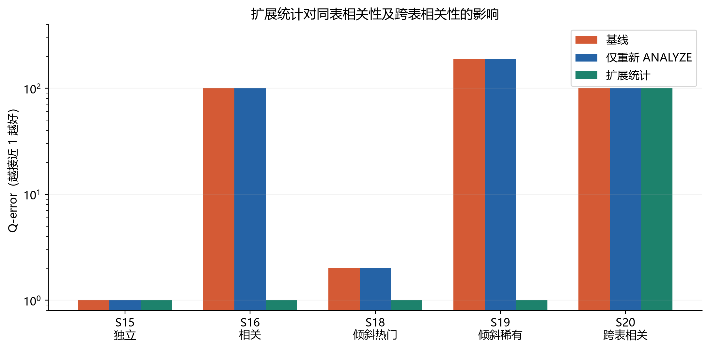

# SQL 与 AI 协同优化基数估计实验

本仓库完成数据库课程小组成员 **B 的 PostgreSQL 实验采集** 和 **C 的基数误差分析**。在真实 PostgreSQL 17.6 中运行 TPC-H SF=1 派生查询和可控合成场景，保存完整执行计划、节点数据、图表和报告。

本轮完成 20 条 SQL、36 个查询配置组合、144 次计划采集（36 次预热、108 次正式测量），保留 364 条节点记录。未训练 AI 模型；查询不是官方 TPC-H 查询集，不报告 TPC-H 性能评分。

## 直接查看成果

- [B 和 C 成员实验报告 PDF](reports/B和C成员实验报告.pdf)
- [可编辑报告正文](reports/实验报告.md)
- [实验环境说明](reports/实验环境说明.md) · [20 条 SQL 查询清单](reports/SQL查询清单.md)
- [查询汇总](results/query_summary.csv) · [Q-error 分组统计](results/qerror_statistics.csv)
- [逐次原始结果](results/query_runs.csv) · [全部节点记录](results/node_runs.csv) · [原始 JSON 执行计划](results/plans)
- [数据核验](reports/数据核验.md) · [字段说明](reports/数据字段说明.md)
- [5 张高清 PNG 和 SVG 图](figures)

| 典型案例 | 基线 Q-error | 扩展统计后 | 观察 |
| --- | ---: | ---: | --- |
| S15 独立属性 | 1 | 1 | 单列边际能够充分表达本例 |
| S16 同表强相关 | 100 | 1 | 修正联合选择率 |
| S19 倾斜稀有组合 | 189.375 | 1 | 修正倾斜与相关的组合误差 |
| S20 跨表相关 | 100 | 100 | 本例超出同表扩展统计作用范围 |



仅重新 `ANALYZE` 未修正上述误差，三个阶段的单列统计快照相同。基数估计改善未伴随 S16/S19 的扫描方式变化，三次计时不支持宣称明显加速。

## 复现环境

需要 Python 3.12 或兼容版本、Docker Desktop/Linux Docker，以及可下载官方 PostgreSQL 镜像和 DuckDB 扩展的网络。首次生成约 1.11 GB CSV，PostgreSQL 数据库约 1.77 GB，另有 DuckDB 源库、镜像和依赖，建议预留至少 8 GB 空间。

在**本仓库目录**执行以下命令。Windows 可用 `py -3.12` 代替 `python`；若使用虚拟环境，请先激活。

```powershell
python -m pip install -r requirements.txt
python scripts/generate_tpch.py --sf 1
python scripts/verify_tpch_exports.py
docker compose up -d --wait
python scripts/run_experiment.py --init --collect
python scripts/analyze_results.py
python scripts/verify_results.py
python scripts/build_pdf.py
```

**仓库附带本次真实 results。** 如需重新采集，先把 `results` 整个目录备份到仓库外，再执行 `--collect`；脚本发现旧结果会拒绝覆盖。首次在新数据库同时使用 `--init --collect`，已有实验数据库使用 `--collect`。数据生成脚本也拒绝覆盖已有 DuckDB 表，重建前请自行备份旧数据。

`generate_tpch.py` 首次下载官方 core tpch 扩展并生成 8 张表。若网络要求代理，按当前网络环境配置。运行不依赖付费服务或数据库插件。生成数据和本地依赖不上传 GitHub，数据版本、schema、CSV 哈希和校验证据保留在仓库中。

图表在 Windows 自动使用微软雅黑或黑体。其他操作系统应安装 CJK 中文字体并让 Matplotlib 使用它；PDF 构建器的字体要求及命令见脚本说明。报告正文包含本次结果，重新采集后必须依据新 CSV 更新正文中的数字，再生成 PDF。

## 本机已完成的环境

当前机器上的容器名为 `sql-ai-cardinality-lab-pg`，数据库名 `cardinality_lab`，数据卷名 `sql-ai-cardinality-lab-pgdata`。本次环境通过等价的 `docker run` 创建，已有该容器时用下列命令启停，无需再次 `compose up` 创建同名容器：

```powershell
docker start sql-ai-cardinality-lab-pg
docker exec -it sql-ai-cardinality-lab-pg psql -U postgres -d cardinality_lab
docker stop sql-ai-cardinality-lab-pg
```

容器使用 `network_mode: none`，不映射宿主端口。采集通过 `docker exec` 与容器内本地 Unix socket 通信。`trust` 认证仅用于这个隔离的教学容器，不是生产部署模板。保留数据库数据卷以便后续成员查询；关闭容器不会删除数据。

## 实验步骤与控制变量

1. 导入 TPC-H、建立主外键及两个辅助索引，执行统计分析。
2. 创建独立、相关、倾斜表各 30 万行，跨表对照含 1 万客户与 30 万订单。
3. 基线采集 20 条查询，各预热一次并正式执行三次；固定种子打乱每轮查询顺序。
4. 仅重新 `ANALYZE`，重测 8 条合成查询，排除统计刷新的解释。
5. 增加同表扩展统计，再测相同 8 条查询。数据与索引不变。
6. 从已保存 JSON 和 CSV 生成图表，独立核验 SQL 哈希、行数、循环、时间与误差。

每个根节点的 `Plan Rows` 与 `Actual Rows` 直接比较。子节点均按每循环口径比较，循环总工作量另列。主分位统计排除实际零行查询，`q_error_safe` 单独保留。没有把预热和重复测量算作新的查询样本。

## 目录

```text
scripts/       数据生成、采集、分析、校验及 PDF 构建
sql/           TPC-H schema、约束、合成数据和扩展统计
results/       环境、数据来源、原始 JSON、CSV 和统计快照
figures/       B 的 2 张基础图与 C 的 3 张分析图
reports/       实验报告、环境、SQL、字段口径与校验说明
data/          本地生成数据，Git 忽略
compose.yaml   固定镜像摘要的隔离 PostgreSQL 环境
```

## 使用边界

这是一组教学查询与受控合成数据的实测。只有单机器、单次建库、每配置三次计时，不能外推到所有工作负载或宣称统计显著的性能提升。PostgreSQL `Cost` 不以毫秒计量；`EXPLAIN ANALYZE` 时间包含测量开销而不包含网络传输。普通 `ANALYZE` 采样和硬件差异可能让复现数值变化。

调研原文、成员身份信息和大体积数据未纳入仓库。来源见报告与 `results/data_provenance.json`；TPC-H 数据及相关组件遵循各自的来源许可，本项目不另行给上游内容重新授权。
