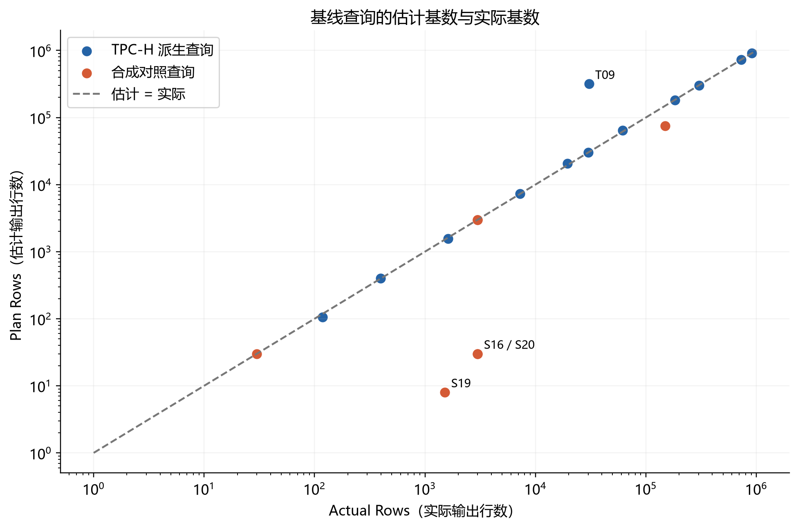
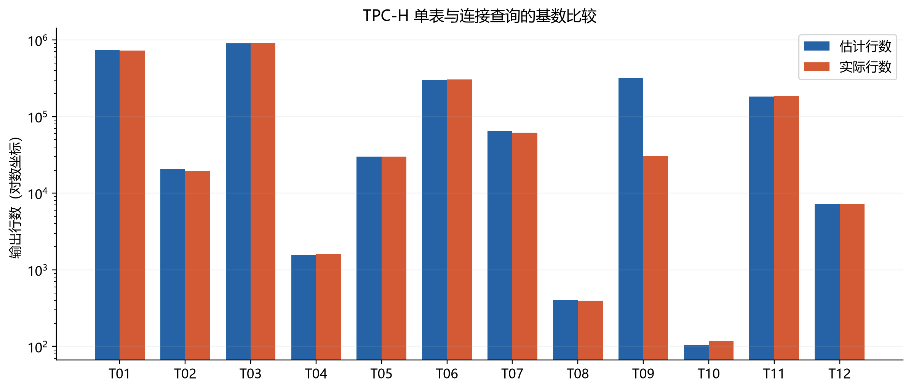
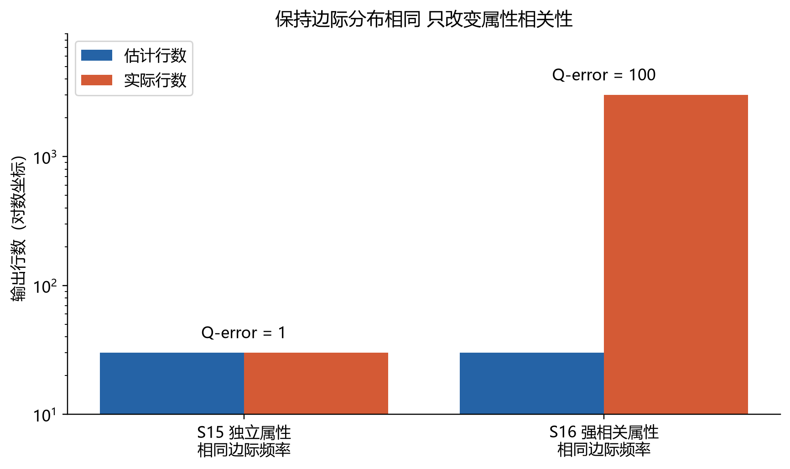
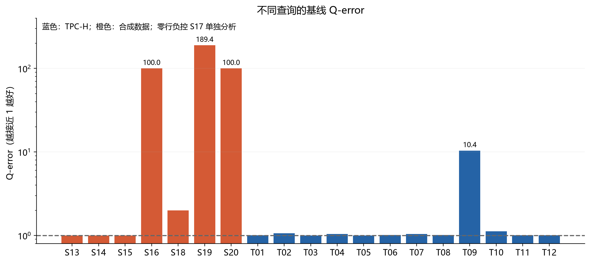

# PostgreSQL 基数估计实验报告

成员 B 实验实施与数据采集　成员 C 误差分析与困难场景

实验日期：2026 年 10 月 2 日。研究主题：SQL 与 AI 协同优化。

## 实验目的与主要发现

本实验承接已有调研中“基数估计与属性相关性”的问题，按照本学期成员分工，完成 PostgreSQL 原生优化器的实证分析。成员 B 建立 TPC-H SF=1 环境，执行 20 条代表性查询并保存节点级原始计划；成员 C 构造独立、强相关、倾斜和跨表相关场景，计算 Q-error，并增加扩展统计对照。

实测表明，简单查询通常估计较准，但相关性能够造成明显误差。相同边际分布下，独立属性查询 S15 的 Q-error 为 1，强相关查询 S16 为 100。加入扩展统计后 S16 降至 1，而跨表相关查询 S20 仍为 100。TPC-H 三表查询 T09 的 Q-error 为 10.371，其余多表查询未全部出现大误差。本轮未训练或评测 AI 模型，结果用于解释学习联合分布等研究方向的动机。

## 实验环境与数据

| 项目 | 本次配置 |
| --- | --- |
| 数据库 | PostgreSQL 17.6，Docker Linux 容器 |
| 宿主环境 | Windows 11，Python 3.12.14 |
| TPC-H 数据生成 | DuckDB 1.5.6 官方 core tpch 扩展，CALL dbgen(sf=1) |
| 查询集 | 12 条 TPC-H 派生 SPJ 查询，8 条合成数据查询 |
| 数据库参数 | shared_buffers 256 MB，work_mem 64 MB，JIT 关闭 |
| 并行与统计 | 并行查询关闭；TPC-H 默认统计目标 100 |
| 合成表统计 | 相关列统计目标 1000，样本容量覆盖 300000 行 |
| 重复采集 | 每个查询及配置预热 1 次，正式测量 3 次 |

TPC-H 八表规模分别为 region 5、nation 25、supplier 10000、customer 150000、part 200000、partsupp 800000、orders 1500000、lineitem 6001215 行。CSV 导出经过行数和整行散列回读校验，导入 PostgreSQL 后再次核对行数。数据建有主外键及 orders 客户键、lineitem 零件供应商键索引，完整定义见 sql/01_constraints.sql。

这些查询为教学目的设计，保留选择、投影与连接，不是官方 TPC-H Q1 至 Q22，也不产生 TPC-H 性能评分。合成数据与 TPC-H 使用独立 schema，原始 TPC-H 数据未被改写。

<!-- pagebreak -->

## 成员 B 数据采集与计量口径

所有查询执行 EXPLAIN (ANALYZE, BUFFERS, SETTINGS, VERBOSE, FORMAT JSON)。采集根节点与所有子节点的 Plan Rows、Actual Rows、Actual Loops、Total Cost、Actual Total Time、Node Type，同时保存查询级 Planning Time 与 Execution Time。每条记录包含 SQL 哈希及原始计划路径，能够回溯到具体 SQL 和 JSON。

查询集包含 5 条单表过滤、3 条两表连接、4 条三至六表连接，以及 8 条合成对照。每轮用固定随机种子打乱执行顺序。基线执行全部 20 条，重新 ANALYZE 和扩展统计阶段各执行 8 条合成查询，共得到 36 个查询配置组合、144 份计划，其中 36 份预热、108 份正式测量，包含 364 条节点记录。

主分析使用无聚合、无 LIMIT 查询的根节点输出基数，避免把 COUNT(*) 的 1 行结果误当被扫描数据量。每次执行的 Plan Rows 与 Actual Rows 直接比较；多循环子节点按每次循环口径比较，Actual Rows 乘 Actual Loops 仅另列为近似总工作量，不与单次 Plan Rows 混算。关闭并行避免 worker 与 Gather 口径混淆。

对正基数，Q-error = max(估计行数 / 实际行数，实际行数 / 估计行数)。数值越接近 1，估计越准确。零实际行数单独标记，不纳入正基数分位数。另保留 q_error_safe，先将两个行数各自下限截为 1 再计算，只作为工程性诊断。

图中每个点代表一个查询，斜线表示估计等于实际。三次正式测量的基数相同，因此每个查询只绘制一个点；零行负控不放入对数散点图。

<!-- pagebreak -->

## 成员 B TPC-H 基础结果

| 查询 | 场景 | 估计行数 | 实际行数 | Q-error |
| --- | --- | --- | --- | --- |
| T01 | 单表状态 | 731600 | 729413 | 1.003 |
| T02 | 单表日期 | 20654 | 19472 | 1.061 |
| T03 | 单表发货日期 | 907803 | 909455 | 1.002 |
| T04 | 品牌和尺寸 | 1552 | 1620 | 1.044 |
| T05 | 客户类别 | 30095 | 30142 | 1.002 |
| T06 | 客户订单连接 | 300950 | 303959 | 1.010 |
| T07 | 订单明细连接 | 64271 | 61850 | 1.039 |
| T08 | 国家供应商连接 | 400 | 396 | 1.010 |
| T09 | 客户订单明细 | 316503 | 30519 | 10.371 |
| T10 | 零件供应关系 | 105 | 118 | 1.124 |
| T11 | 地域到订单明细五表 | 182589 | 184082 | 1.008 |
| T12 | 六表连接 | 7304 | 7243 | 1.008 |

单表组 Q-error 中位数为 1.003，两表组为 1.010，多表组为 1.066。多表组最大值 10.371 来自 T09。连接表数增加会带来表达相关性和传播误差的挑战，但本次结果不支持“连接越多必然误差越大”的说法。

<!-- pagebreak -->

## 成员 C 强相关属性的受控实验

我们构造两个各有 300000 行的表，city 和 zipcode 各有 100 种取值，每个单列取值都恰好出现 3000 次。独立表覆盖全部 10000 种组合，每种 30 行；相关表只包含 100 种同号组合，每种 3000 行。两个表的结构、规模、边际频率和统计目标相同，主要改变联合分布。

S13 与 S14 分别在独立表和相关表只筛选 city，两者估计与实际均为 3000。S15 与 S16 同时筛选 city='C00' 和 zipcode='Z00'，估计均为 30，但实际分别为 30 和 3000。单列分布可以被准确描述，却不足以表达两列之间的依赖。

在独立性近似下，联合选择率为 0.01 × 0.01 = 0.0001，估计行数为 300000 × 0.0001 = 30。相关表中同号 zipcode 已由 city 确定，真实联合选择率是 0.01，真实结果为 3000，因此低估 100 倍。

零行负控 S17 筛选 city='C00' 且 zipcode='Z01'，基线估计 30，实际 0。常规正基数 Q-error 在此不作有限值报告，不能将安全版本的 30 混入常规分位数。扩展统计后估计变为 1，仍不能说 PostgreSQL 精确预测为零；其估计下限与工程约定需要单独解释。

<!-- pagebreak -->

## 成员 C 倾斜与连接中的误差

倾斜表同样有 300000 行。其中 C00/Z00 占 150000 行，其余 99 个同号组合平分余下数据。S18 查询热门组合，估计 75000，实际 150000，Q-error 为 2；S19 查询 C42/Z42，估计 8，实际 1515，Q-error 为 189.375。单列统计已经识别热门值，本次困难来自倾斜与联合相关性的组合，不能将结果解释为“PostgreSQL 无法处理任何倾斜”。

跨表查询 S20 将 10000 个客户与 300000 笔订单连接。客户表只保存 city，订单表只保存 zipcode，各客户固定有 30 笔订单，订单邮编与客户城市编码一致。客户城市和订单邮编各自的过滤估计正确，但连接后的联合条件估计仅为 30，实际为 3000，Q-error 为 100。

TPC-H 案例 T09 进一步体现连接条件下的相关性：订单要求早于 1995-03-15，明细发货日期要求晚于同一天，同时筛选客户类别。订单日期与发货日期存在业务联系，在连接后不能简单使用全表边际选择率。明细过滤节点估计 3247322、实际 3241776，客户订单子连接估计 146199、实际 147126，均较准确；最上层连接却估计 316503、实际 30519。误差主要在最上层连接处出现，不能描述为所有底层误差逐级单调扩大。

<!-- pagebreak -->

## 成员 C 扩展统计的修正与边界

先完成基线，再仅重新执行 ANALYZE 作为对照，最后创建多列 dependencies、mcv 和 ndistinct 统计并再次 ANALYZE。三个阶段保持数据、SQL、索引和数据库执行参数相同。保存的三个 pg_stats 快照完全一致，说明本次观察到的估计修正不来自单列统计变化。由于同时加入多类扩展统计，不能从本实验单独分离 dependencies 与 MCV 的贡献；ndistinct 主要用于分组基数，此处不据其声称改善 SPJ。

| 查询 | 基线 Q-error | 仅 ANALYZE | 扩展统计 | 实际行数 |
| --- | --- | --- | --- | --- |
| S15 独立 | 1 | 1 | 1 | 30 |
| S16 强相关 | 100 | 100 | 1 | 3000 |
| S18 倾斜热门 | 2 | 2 | 1 | 150000 |
| S19 倾斜稀有 | 189.375 | 189.375 | 1 | 1515 |
| S20 跨表相关 | 100 | 100 | 100 | 3000 |

同表强相关和倾斜查询在本次对照中得到精确修正。跨表相关查询 S20 仍有 100 倍误差，即便订单表建立了 customer_id 与 zipcode 的同表扩展统计，仍不能表达客户表 city 谓词与订单表 zipcode 谓词之间的完整关联。这说明原生修正机制的适用范围有限，也为调研中跨表联合分布学习提供了具体问题背景。

<!-- pagebreak -->

## 执行时间的解释与交接

| 查询 | 仅 ANALYZE 中位耗时 ms | 扩展统计中位耗时 ms | 前后根节点 |
| --- | --- | --- | --- |
| S16 强相关 | 9.813 | 9.792 | Seq Scan |
| S19 倾斜稀有 | 9.399 | 9.559 | Seq Scan |
| S20 跨表相关 | 11.666 | 11.456 | Hash Join |

S16 和 S19 的基数估计显著修正，但扫描方式未改变，Total Cost 均保持 6122。固定读取并检查同样的数据页能够解释这一现象。S20 的 Hash Join 和估计代价 5551.12 也未改变。Q-error 下降不等同于计划切换或执行加速，本次三次计时不足以判断细微差异具有统计显著性。

所有耗时来自 EXPLAIN ANALYZE 的服务端执行计时，包含分析插桩开销，不包含客户端结果传输。预热不保证整个 SF=1 数据驻留共享缓冲区；未清空操作系统缓存，也未随机交错三个阶段，因此时延仅作为教学描述。Cost 为优化器代价单位，不能与毫秒直接相除形成“成本误差”。

每组查询数量较少。qerror_statistics.csv 按独立查询汇总 p50、p90、p99 和最大值，分位数采用线性插值，未把三次重复当成三个独立样本；小样本高分位只描述本查询集，不能代表生产负载的尾部分布。

成员 D 可优先使用 T09 的最上层连接失真与 S16 的统计修正对照，原始树均在 results/plans 中，node_runs.csv 提供路径和父节点路径。成员 E 可将同表与跨表相关性现象联系到 DeepDB、NeuroCard 等联合分布学习思路，将查询标签联系到 MSCN；本次没有测得这些 AI 方法的性能或准确率，不能写成 AI 优于 PostgreSQL 的实验结论。

## 交付文件与复现

成员 B 的交付包括 reports/实验环境说明.md、reports/SQL查询清单.md、results/query_runs.csv、results/node_runs.csv、results/plans 和两张 B 系列图。成员 C 的交付包括 results/query_summary.csv、results/qerror_statistics.csv、三张 C 系列图及本报告中的受控案例与结论。

从仓库 README.md 按步骤生成数据、启动独立 PostgreSQL、执行 run_experiment.py，再执行 analyze_results.py。verify_results.py 可以直接核对仓库中的原始计划和汇总数据。首次运行时需要 Docker Desktop 与 Python；大体积数据通过脚本生成。更换机器或重新 ANALYZE 时，采样、计划和计时可能变化，应以新的原始结果重新生成报告。

## 资料来源

研究背景与任务范围依据小组原始前沿探索报告第 3 章及成员分工方案。本次公开或共享产物不复制原始文件中的个人信息。

- PostgreSQL 17 EXPLAIN 文档：https://www.postgresql.org/docs/17/using-explain.html
- PostgreSQL 17 多列统计文档：https://www.postgresql.org/docs/17/multivariate-statistics-examples.html
- PostgreSQL 17 CREATE STATISTICS 文档：https://www.postgresql.org/docs/17/sql-createstatistics.html
- DuckDB TPC-H 扩展说明：https://duckdb.org/docs/stable/core_extensions/tpch.html
- 数据生成版本与文件校验见 results/data_provenance.json 和 results/csv_verification.json。
